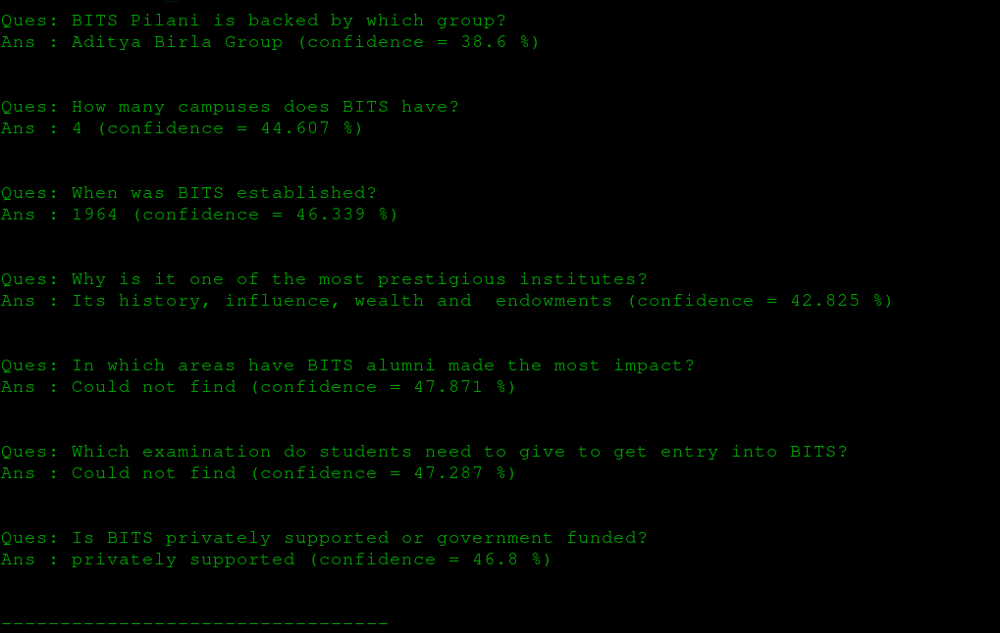

# SAN
Implementing the paper [Stochastic Attention Networks for SQuAD 2.0](https://arxiv.org/pdf/1809.09194.pdf).   
This was the final course project for the course Neural Networks and Fuzzy logic at BITS Pilani.

## Team
- [Manan Soni](https://github.com/MananSoni42)
- [Vibhu Verma](https://github.com/vibhuverma99)
- [Vaibhav Ajmera](https://github.com/vajmera)

## Overview
The Stochastic Answer network is one of the state-of-the art models for Machine Reading comprehension. The goal is to teach the model to read and comprehend a given passage/paragraph and answer its corresponding questions

## Objectives
* [x] Reproduce results of the joint SAN and joint SAN + classifier. (Note the training of these models is the same so computationally, it shouldn’t be very expensive to reproduce both results as compared to just one.)
* [x] Plot Lspan, Lclassifier, and overall loss and also training accuracy and f1 with epochs.
* [x] Reproduce the classifier accuracy **(differs by ~8%)**
* [x] Report other metrics - precision, recall, accuracy f1 for joint, joint+classifier, and on classifier alone as well.  
**(Have not trained on the classifier alone)**
* [x] Experiment with different lambdas in the loss function and see how accuracy of classifier changes. (In case this gets computationally very expensive, we can discuss what to do about it later)

## Results

|    Lambda value    |       Model type       | Epochs | Train accuracy | Train EM score | Train F1 score | Dev accuracy | Dev EM score | Dev F1 score |
|:------------------:|:----------------------:|:------:|:--------------:|:--------------:|:--------------:|:------------:|:------------:|:------------:|
|         0.5        | Joint SAN + classifier |   50   |        -       |        -       |        -       |     70.34    |     62.63    |    65..75    |
|         1.0        | Joint SAN + classifier |   28   |      86.27     |      70.17     |      76.73     |     68.69    |     59.93    |     63.17    |
|         1.0        |        Joint SAN       |   31   |       NA       |      45.91     |      53.47     |      NA      |     34.28    |     38.11    |
|        10.0        | Joint SAN + classifier |   50   |      92.53     |       73.17    |       80.79    |     68.47    |     59.30    |     62.84    |
|        10.0        |        Joint SAN       |   21   |       NA       |      44.83     |      52.38     |      NA      |     33.61    |     36.85    |
| 1.5 (best results) | Joint SAN + classifier |   50   |      92.96     |      79.10     |      85.61     |     70.55    |     60.58    |     63.46    |
| 1.5 (best results) |        Joint SAN       |   50   |       NA       |      78.37     |      84.88     |      NA      |     61.18    |     64.39    |

## Examples




### Installation and setup

* Requires Python3+ and pip3 to be installed
* To install all dependancies:
    * ```pip3 install -r requirements.txt```
    * ```python3 -m spacy download "en"```
    * ```get_data.sh```

### Module structure
```
├── NNFL_SAN.pdf     # our final PPT
├── san-1.pdf        # The author's original paper (based on SQuAD v1.1)
├── san-2.pdf        # The paper we have implemented (based on SQuAD v2.0)
├── requirements.txt # Python libraries required
├── *.sh             # wrapper scripts (written in bash) to easily test various modeules
├── data/            # All data files will be stored here (empty in this case)
├── src/             # source code for model arch, batch generation, lexicon/contextual layers, etc
├── utils/           # Utility scripts for preprocessing
├── my_utils/        # Utility scripts used throughout the code
├── results/         # Contains epoch-wise results (.csv) and evaluation results (.txt)
└── plot/            # Contains all the plots mentioned in the PPT (.jpg)
```

### Scripts for running the different modules
> **NOTE**: You must run the get_data.sh script completely to execute any of the other Scripts

* Download the datasets and our model weights: ```./get_data.sh``` (~3.5 GB)
* Pre-process the data ```./preprocess.sh```
* Train the model ```./train.sh``` (Recommended to use ```train.py``` with correct arguements instead)
* Evaluate the model ```./evaluate.sh path_to_checkpoint```
* Plot graphs ```./plot_results.py``` (graphs are stored in plot/)
* Run the model on a custom sample: ```./predict_sample.py```
> **NOTE**: To run the last script, put your custom paragraph in paragraph.txt and your questions (1 per line) in questions.txt (samples have been provided in these files)

## Contributing
Feel free to contribute features / point out errors. Fork this repository and make a pull request.  

## License
This project is licensed under the [BSD-3](https://opensource.org/licenses/BSD-3-Clause) License
